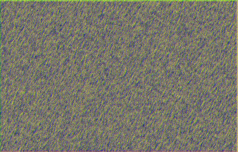
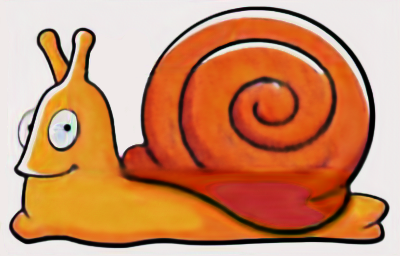
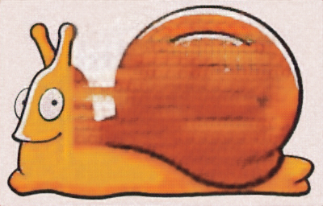
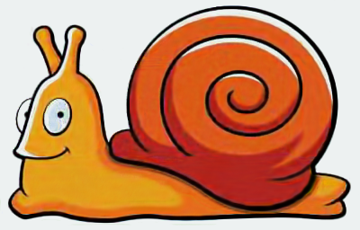

# deep-image-prior-tensorflow
A simple yet working implementation of Deep Image Prior paper [https://arxiv.org/pdf/1711.10925.pdf](https://arxiv.org/pdf/1711.10925.pdf) using tensorflow. 

Currently I only implemented the denoising use case.

Denoising to remove the image compression artifact.

 

Results after every 1000 iterations, [!] the last one is not always the best one:

